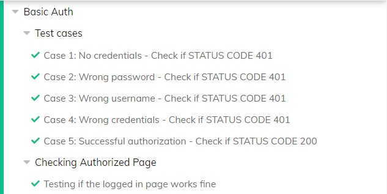
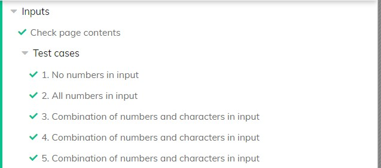

# OBJECTIVE

Write functional tests using Cypress covering the following use cases in "https://the-internet.herokuapp.com" website
1. User can login only using right username and password (Basic Auth)
2. Welcome message rendered on button click (Dynamically Loaded Page Elements)
3. Input component can accept only numbers (Inputs)

# OVERVIEW
## 1.Basic Auth

### STEPS
> Verify if valid status codes are sent for each of the following test 
>
>#### Test Cases
>1) No credentials provided (Status 401) 
>2) Wrong password entered (Status 401) username = "admin", password = "srijith"
>3) Wrong username entered (Status 401) username = "srijith", password = "admin"
>4) Wrong credentials entered (Status 401) username = "srijith", password = "srijith"
>5) Valid credentials provided (Status 200) username = "admin", password = "admin"
>6) Verify if authorized page works fine.

## 2.Dynamically Loaded Page Elements

Verify if "Hello World!" is dynamically loaded on the webpage
### STEPS
>1) Verify page contents of the website
>2) Element on page that is hidden
>    - Verifying that the hidden element is not visible
>    - Clicking on start button
>    - Verifying that the element is visible after click
>
>3)  Element rendered after the fact
>       - Verifying that there is no existing element 
>       - Clicking on start button
>       - Verifying that dynamically rendered element is visible after click

## 3. Inputs
Verify if the input component accepts only numbers 

### STEPS
>1. Verify page contents
>2. Verify for input component
>	    - No numbers entered = Nothing is accepted
>	    - Only numbers entered = All numbers accepted
>	    - Combination of numbers, characters & spl. characters = Only numbers accepted

# SETUP:
1. Download Node.js from https://nodejs.org/en/download/

2. Clone the repository 
3. In Terminal,
>    - npm init -y
>    - npm install cypress
>    - npx cypress open
